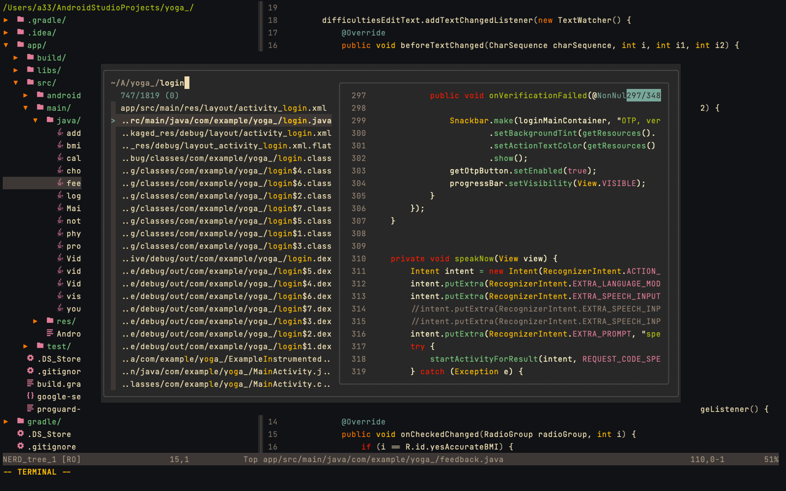
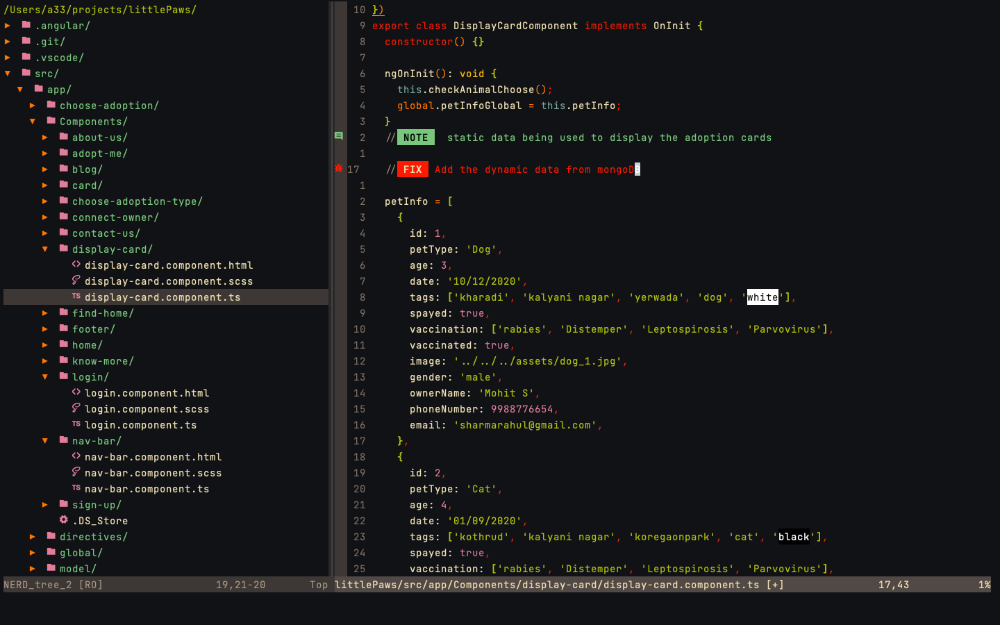
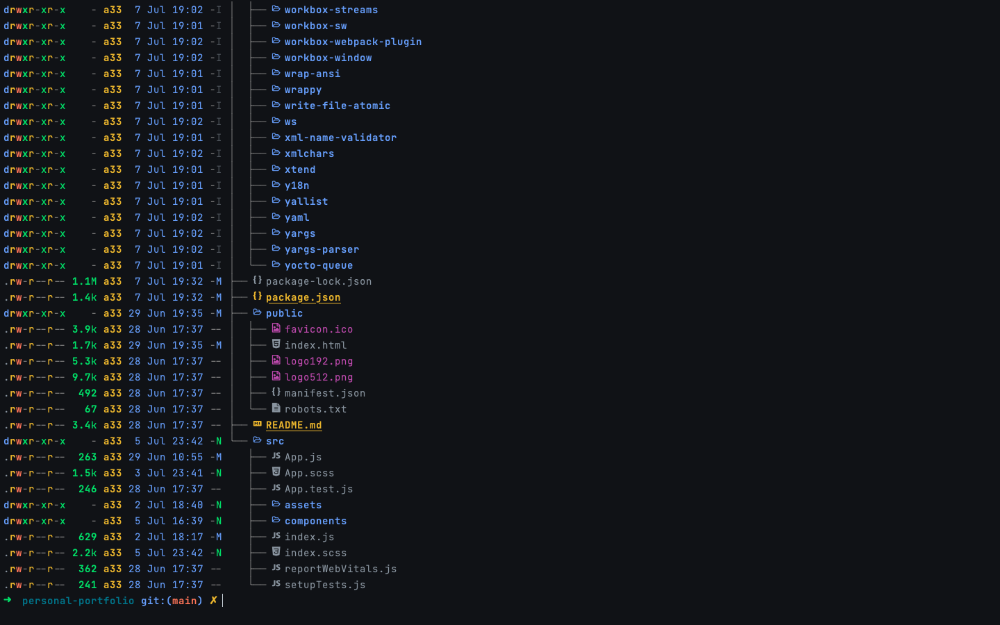

# Personal dot files
---

---
## System 
- [MacOS Big Sur](https://apps.apple.com/us/app/macos-big-sur/id1526878132?mt=12)   _version 11.6.5_
- [iterm2](https://iterm2.com/)  _build 3.4.16_
- [nvim](https://neovim.io/) _>= 5.0_

## Primary color scheme / theme 

- [iterm2 colors](https://iterm2colorschemes.com/) ( github dark )
- [nvim theme](https://github.com/morhetz/gruvbox) ( gruvbox )

## File traversing 
- iterm2 ( [fzf](https://github.com/junegunn/fzf), [vifm](https://vifm.info/) ( File Manager/explorer) )
- nvim ( fzf, [nerdtree](https://github.com/preservim/nerdtree) )

## Plugin/Package Manager
- iterm2/mac [homebrew](https://brew.sh/)
- nvim [Plug](https://github.com/junegunn/vim-plug)
 
## How to use 
_I, myself had/have hardtime figuring out a better working environment. So depending on your needs you can find the plugins to use provided in the init.vim ( with comments specifying their usage ) & .zshrc file.If you have any doubts/problems related to any plugin mentioned in the file, you can contact me through mail provided_

## Contact 
 arvindchoudhary.in.connect@gmail.com
